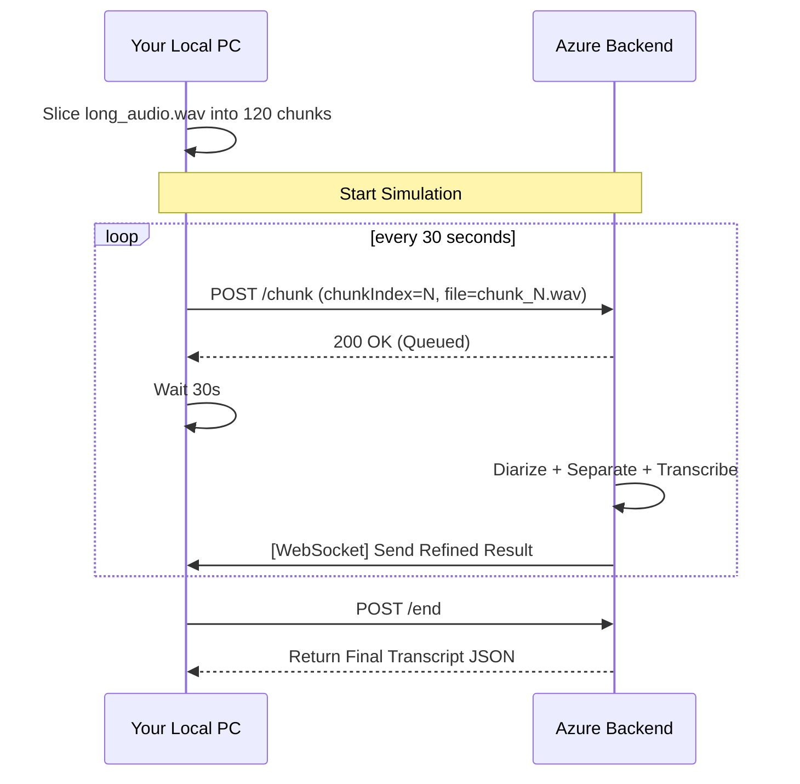

# Real-time Meeting Simulator (Test Client Design)

This design outlines a local Python script that simulates a 1-hour meeting by slicing a local audio file and streaming it to the backend every 30 seconds.

## 🛠️ Core Components

### 1. Audio Slicer (`ffmpeg`)
- **Function**: Takes a long audio file (e.g., `meeting_1h.wav`) and creates a temporary directory of 30-second chunks.
- **Command**: `ffmpeg -i input.wav -f segment -segment_time 30 -c copy chunks/chunk_%03d.wav`

### 2. Stream Simulator (The Loop)
- **Logic**: 
  - Iterates through the `chunks/` folder in order.
  - For each chunk:
    1. Sends a `POST /chunk` request to the Azure backend.
    2. Includes the correct `chunkIndex` (0, 1, 2...).
    3. **Waits exactly 30 seconds** (or slightly less to account for network latency) before the next upload.

### 3. Live Feedback Monitor
- **WebSocket Option**: Connects to `wss://.../ws` to receive and print real-time transcription as it arrives.
- **Polling Option**: Calls `GET /result` every 10 seconds to show the accumulating transcript.

---

## 🚀 Execution Flow

## 📈 Why this is better than Swagger
1. **Automation**: No manual file selection or clicking every 30s.
2. **Stress Test**: Verifies if the T4 GPU can keep up with a continuous 1-hour stream without drifting or piling up tasks.
3. **v8 Validation**: Checks if frequent overlapping segments trigger separation logic correctly in a "real" sequence.

---

## 📝 Next Step?
I can provide a single-file Python script (`simulate_meeting.py`) that handles all of this. It will require `ffmpeg` installed on your local machine and the `requests` library.
